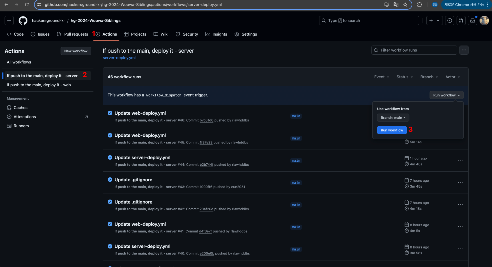
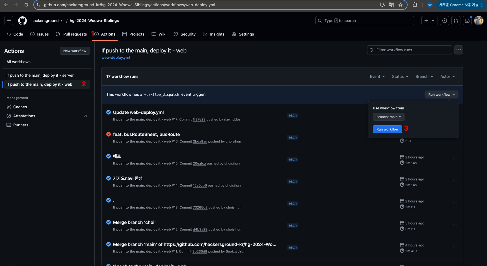

# `우아한남매들` - `캔버스(Canbus)`

해커그라운드 해커톤에 참여하는 `우아한남매들` 팀의 `캔버스(Canbus)`입니다.

## 참고 문서

> 아래 두 링크는 해커톤에서 앱을 개발하면서 참고할 만한 문서들입니다. 이 문서들에서 언급한 서비스 이외에도 더 많은 서비스들이 PaaS, SaaS, 서버리스 형태로 제공되니 참고하세요.

- [순한맛](./REFERENCES_BASIC.md)
- [매운맛](./REFERENCES_ADVANCED.md)

## 제품/서비스 소개

<!-- 아래 링크는 지우지 마세요 -->
[제품/서비스 소개 보기](TOPIC.md)
<!-- 위 링크는 지우지 마세요 -->

## 오픈 소스 라이센스

<!-- 아래 링크는 지우지 마세요 -->
[오픈소스 라이센스 보기](./LICENSE)
<!-- 위 링크는 지우지 마세요 -->

## 설치 방법

> **아래 제공하는 설치 방법을 통해 심사위원단이 여러분의 제품/서비스를 실제 Microsoft 애저 클라우드에 배포하고 설치할 수 있어야 합니다. 만약 아래 설치 방법대로 따라해서 배포 및 설치가 되지 않을 경우 본선에 진출할 수 없습니다.**

### 사전 준비 사항

> 여러분의 제품/서비스를 Microsoft 애저 클라우드에 배포하기 위해 사전에 필요한 준비 사항들을 적어주세요.
>

- Github 계정 - [Github 회원가입](https://github.com/signup)
- Azure 구독
- MySQL Workbench, TablePlus, CLI 환경 등 **DB 연결 도구**
    - [MySQL Workbench 설치 링크](https://dev.mysql.com/downloads/workbench/)
    - 이 문서에서는 MySQL Workbench를 기준으로 설명합니다
    - 본인의 운영체제에 맞는 버전을 선택해주세요
    - Download 버튼을 눌러 설치 패키지를 다운로드 받고 패키지를 실행해 설치 프로세스를 따라 설치해주세요

    - [Windows 설치 가이드](WORKBENCH_INSTALL_WIN.md)

    - [Mac 설치 가이드](WORKBENCH_INSTALL_MAC.md)

## 시작하기

> 여러분의 제품/서비스를 Microsoft 애저 클라우드에 배포하기 위한 절차를 구체적으로 나열해 주세요.
>

이 문서에서 Github Actions 관련 작업은 https://github.com/hackersground-kr/hg-2024-Woowa-Siblings 레포지토리를 우측 상단에 있는 Fork 버튼을 눌러 본인 소유의 레포지토리로 Fork를 한 후 작업합니다

0. Fork 받은 Repository를 클론해옵니다

```bash
git clone https://github.com/<자신의 GitHub ID>/hg-2024-Woowa-Siblings
```

1. 레포지토리를 클론 받아온 위치에서 Windows는 CMD, Mac은 터미널을 실행합니다.
2. 작업을 진행하기 위해 변수에 필요한 정보를 저장하고 시작합니다.

```bash
TEAM_NAME=<your-team-name>
SERVICE_NAME=<your-service-name> # canbus로 하는 것을 추천합니다
RG_NAME=<your-resource-group-name>
REPO=<your-fork-repository-name>
DB_USERNAME=<db-username>
DB_PASSWORD=<db-password> # 영어, 숫자, 특수문자 포함해야 합니다 (비밀번호에 !를 사용할 경우 ! 앞에 백틱을 꼭 붙여줘야 합니다! ex) \! )
```

3. canbus-server/ 경로에 .env 파일이 존재하지 않으면 템플릿을 만듭니다

```bash
if [ ! -f canbus-server/.env ]; then
  echo 'DB_URL=' > canbus-server/.env
  echo 'DB_SCHEMA=' >> canbus-server/.env
  echo 'DB_USERNAME=' >> canbus-server/.env
  echo 'DB_PASSWORD=' >> canbus-server/.env
  echo '' >> canbus-server/.env
  echo 'JWT_ACCESS_KEY=' >> canbus-server/.env
  echo 'JWT_REFRESH_KEY=' >> canbus-server/.env
  echo 'JWT_ACCESS_EXPIRED=' >> canbus-server/.env
  echo 'JWT_REFRESH_EXPIRED=' >> canbus-server/.env
fi
```

4. 2에서 기입했던 내용에 맞게 .env 파일을 수정하고 ENV_FILE 변수에 파일 내용을 저장합니다

```bash
sed -i '' "s/^DB_URL=.*/DB_URL=$TEAM_NAME-db.mysql.database.azure.com/" canbus-server/.env
sed -i '' "s/^DB_SCHEMA=.*/DB_SCHEMA=$SERVICE_NAME-db/" canbus-server/.env
sed -i '' "s/^DB_USERNAME=.*/DB_USERNAME=$DB_USERNAME/" canbus-server/.env
sed -i '' "s/^DB_PASSWORD=.*/DB_PASSWORD=$DB_PASSWORD/" canbus-server/.env
sed -i '' "s/^JWT_ACCESS_KEY=.*/JWT_ACCESS_KEY=asdadsdas-access-token-sign-key/" canbus-server/.env
sed -i '' "s/^JWT_REFRESH_KEY=.*/JWT_REFRESH_KEY=asdadasasda-refresh-token-sign-key/" canbus-server/.env
sed -i '' "s/^JWT_ACCESS_EXPIRED=.*/JWT_ACCESS_EXPIRED=1/" canbus-server/.env
sed -i '' "s/^JWT_REFRESH_EXPIRED=.*/JWT_REFRESH_EXPIRED=7/" canbus-server/.env

ENV_FILE=$(cat canbus-server/.env)
```

5. Azure와 Github에 로그인을 하고 AZURE_CREDENTIALS 변수에 값을 저장합니다

```bash
az login
gh auth login

AZURE_CREDENTIALS=$(az ad sp create-for-rbac \
  --name $TEAM_NAME-credentials \
  --role contributor \
  --scopes /subscriptions/bfa39d86-1058-4824-8074-e9d283d6c321/resourceGroups/$RG_NAME \
  --json-auth \
  --output json)
```

6. github에 secret을 설정합니다

```bash
gh secret set TEAM_NAME --body "$TEAM_NAME" --repo $REPO
gh secret set SERVICE_NAME --body "$SERVICE_NAME" --repo $REPO
gh secret set RG_NAME --body "$RG_NAME" --repo $REPO
gh secret set ENV_FILE --body "$ENV_FILE" --repo $REPO
gh secret set AZURE_CREDENTIALS --body "$AZURE_CREDENTIALS" --repo $REPO
```

7. 2에서 기입한 내용과 infra.bicep 파일을 기반으로 DB와 Container Registry를 배포합니다

```bash
az deployment group create \
	--resource-group $RG_NAME \
	--template-file canbus-infra/infra.bicep \
	--parameters teamName=$TEAM_NAME \
  --parameters username=$DB_USERNAME \
	--parameters password=$DB_PASSWORD
```

8. 만들어진 컨테이너 레지스트리 리소스에 들어가 1번과 2번을 눌러 액세스 키 탭에 들어와주시고
   사용자 이름과 password를 메모장에 복사해놓습니다


9. 자동화 배포를 사용하기 위해서 앞서 받은 ACR 정보를 기입하고, secret에 추가합니다

```bash
gh secret set ACR_NAME --body <레지스트리 이름> --repo $REPO
gh secret set ACR_USERNAME --body <복사해둔 사용자 이름> --repo $REPO
gh secret set ACR_PASSWORD --body <복사해둔 password> --repo $REPO
```

10. 1번, 2번, 3번 순서대로 클릭하여 서버 배포를 시작합니다



11. 1번, 2번, 3번 순서대로 클릭하여 웹 배포를 시작합니다

